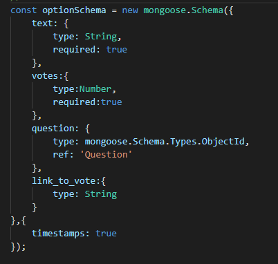
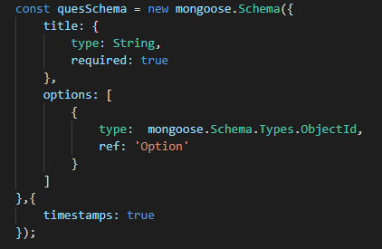

# POLLY
This is a repository Made in Coding Ninjas Mock Test 3.

## Index
  - [Product Features](#product-feautres)
  - [Schemas](#schemas)
  - [EndPoints](#end-points)
  - [Setup](#setup)

## Product Features
- You can add as many questions as you want.
- Add options to a question
- Add a vote to an option of question
- Delete a question, an option
- View a question with it's options and all the votes.
- Used mongoDB to store the data.
- Used Mongoose Schemas to manage the database.
- Added Postman Collections and MongoDump as well.

## Schemas
- Option Schema 
 
- Question Schema 
 

## End Points
- POST `/questions/create` To create a question 
- GET `/questions/:id` To view a question and it's options 
- POST `/questions/:id/options/create` To add options to a specific question
- POST `/options/:id/add_vote` To increment the count of votes
- DELETE `/questions/:id/delete` To delete a question
- DELETE `/options/:id/delete` To delete an option

## Setup
- In the terminal, run `git clone https://github.com/shivamyth/polling-api.git  `.
- run `npm i`.
- run `npm start`.
- Now You are set to go!
